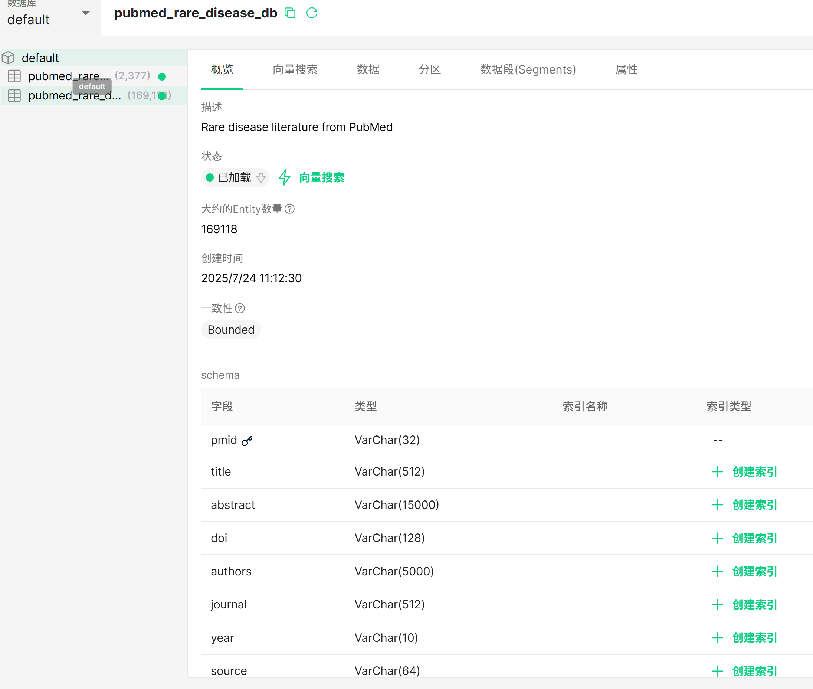

# VecMed-MCP: Milvus Vector Database for Medical Data

## Project Overview


This repository provides tools to establish and manage a Milvus vector database for medical data, specifically designed for rare disease research. It includes scripts for database initialization, data ingestion, search functionality, LLM-based result summarization, and scheduled updates.

## File Descriptions

| File Name | Purpose |
|-----------|---------|
| `docker-compose.yml` | Used to initialize MilvusDB |
| `setup_milvus.py` | Formulates the database schema |
| `download_pubmed_tomilvusdb.py` | Handles timely updates (currently set to 30 days) |
| `search_milvusdb.py` | Tests search functionality in MilvusDB |
| `llm_process_search_result.py` | Experiments with summarizing search results using LLM |
| `updating_milvusdb.log` | Records database updating operations |

## ATTU WebUI
The ATTU WebUI provides a visual interface to:
- View all database records
- Manage collections and schemas
- No authentication required

**Current Collection**: `pubmed_rare_disease_db` contains over 160,000 PubMed records related to rare diseases.



## Environment Configuration

### Launch Milvus with Docker Compose
```bash
docker compose up -d
```

### Install Required Dependencies
```bash
pip install marshmallow==3.20.1 -i https://pypi.tuna.tsinghua.edu.cn/simple
pip install Flask -i https://pypi.tuna.tsinghua.edu.cn/simple
pip install pymilvus -U -i https://pypi.tuna.tsinghua.edu.cn/simple
pip install "mcp[cli]" -i https://pypi.tuna.tsinghua.edu.cn/simple
```

### Set Up ATTU WebUI
```bash
docker pull zilliz/attu:v2.4.4
docker run -d --name attu -p 8000:3000 -e MILVUS_URL=192.168.10.199:19530 zilliz/attu:v2.4.4
```

## Workflow

The general workflow can be adapted for various database types beyond medical articles:

1. Build your custom Milvus database with a designed collection schema using the main folder code (steps 1-5)
2. Download required data and store it in your vector database (see `download_pubmed_2015-2025` subfolder)
3. Launch the MCP server with HTTP API service or modify to use stdin transport (see `pubmed-mcp-server` subfolder)
4. Set up timer-based database updates using `download_pubmed_to_milvusdb_2.py`
5. Integrate the MCP server into your agent/LLM/workflow (example integration with Dify workflow provided)


## Scheduled Database Updates

### Add a New Cron Job
```bash
crontab -e
```

### View Existing Cron Jobs
```bash
crontab -l
```

## Author

**David Qu**  
Undergraduate Researcher | AI Algorithm Engineer  
University of Toronto Scarborough - Department of Computer Science  
📧 davidsz.qu@mail.utoronto.ca
